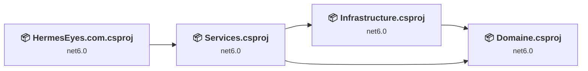
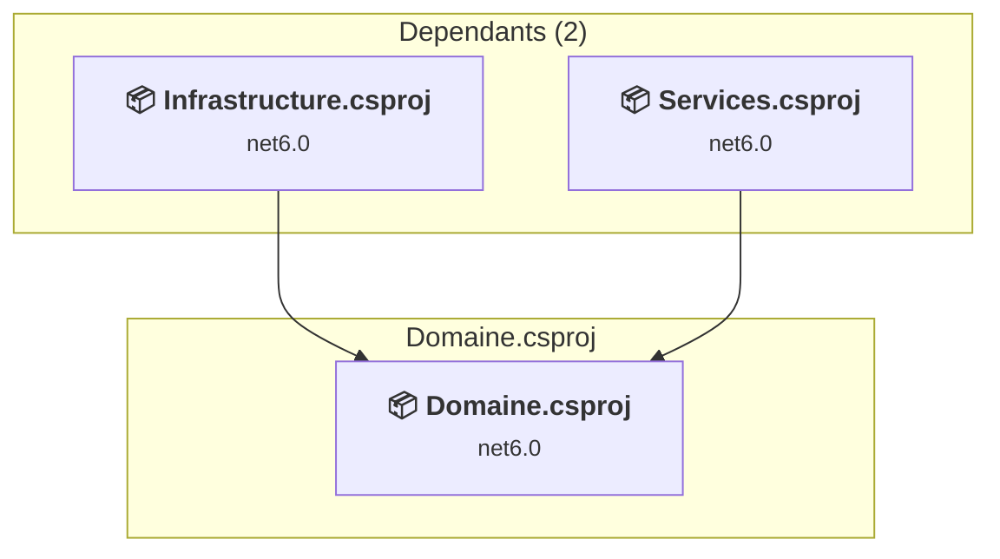
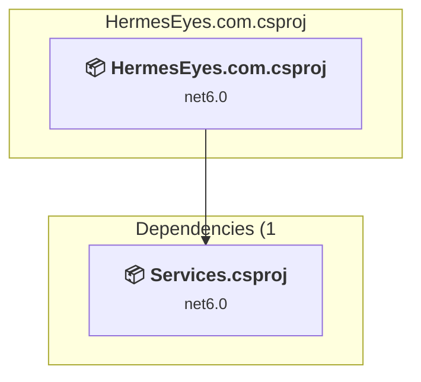
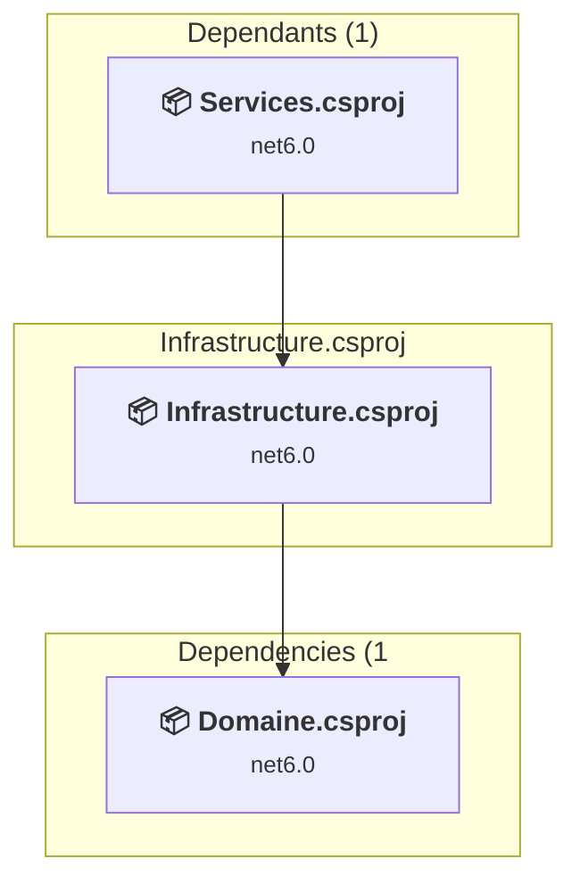
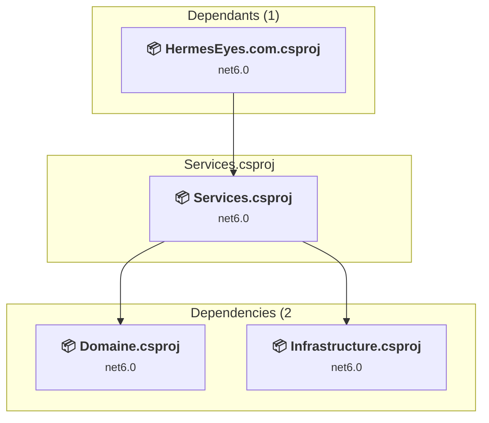

# Projects and dependencies analysis

This document provides a comprehensive overview of the projects and their dependencies in the context of upgrading to .NETCoreApp,Version=v10.0.

## Table of Contents

- [Executive Summary](#executive-Summary)
  - [Highlevel Metrics](#highlevel-metrics)
  - [Projects Compatibility](#projects-compatibility)
  - [Package Compatibility](#package-compatibility)
  - [API Compatibility](#api-compatibility)
- [Aggregate NuGet packages details](#aggregate-nuget-packages-details)
- [Top API Migration Challenges](#top-api-migration-challenges)
  - [Technologies and Features](#technologies-and-features)
  - [Most Frequent API Issues](#most-frequent-api-issues)
- [Projects Relationship Graph](#projects-relationship-graph)
- [Project Details](#project-details)

  - [Domaine\Domaine.csproj](#domainedomainecsproj)
  - [HermesEyes.com\HermesEyes.com.csproj](#hermeseyescomhermeseyescomcsproj)
  - [Infrastructure\Infrastructure.csproj](#infrastructureinfrastructurecsproj)
  - [Services\Services.csproj](#servicesservicescsproj)

## Executive Summary

### Highlevel Metrics

| Metric | Count | Status |
| :--- | :---: | :--- |
| Total Projects | 4 | All require upgrade |
| Total NuGet Packages | 12 | 6 need upgrade |
| Total Code Files | 63 |  |
| Total Code Files with Incidents | 7 |  |
| Total Lines of Code | 5504 |  |
| Total Number of Issues | 16 |  |
| Estimated LOC to modify | 4+ | at least 0.1% of codebase |

### Projects Compatibility

| Project | Target Framework | Difficulty | Package Issues | API Issues | Est. LOC Impact | Description |
| :--- | :---: | :---: | :---: | :---: | :---: | :--- |
| [Domaine\Domaine.csproj](#domainedomainecsproj) | net6.0 | 🟢 Low | 2 | 0 |  | ClassLibrary, Sdk Style = True |
| [HermesEyes.com\HermesEyes.com.csproj](#hermeseyescomhermeseyescomcsproj) | net6.0 | 🟢 Low | 1 | 2 | 2+ | AspNetCore, Sdk Style = True |
| [Infrastructure\Infrastructure.csproj](#infrastructureinfrastructurecsproj) | net6.0 | 🟢 Low | 4 | 1 | 1+ | ClassLibrary, Sdk Style = True |
| [Services\Services.csproj](#servicesservicescsproj) | net6.0 | 🟢 Low | 1 | 1 | 1+ | ClassLibrary, Sdk Style = True |

### Package Compatibility

| Status | Count | Percentage |
| :--- | :---: | :---: |
| ✅ Compatible | 6 | 50.0% |
| ⚠️ Incompatible | 0 | 0.0% |
| 🔄 Upgrade Recommended | 6 | 50.0% |
| ***Total NuGet Packages*** | ***12*** | ***100%*** |

### API Compatibility

| Category | Count | Impact |
| :--- | :---: | :--- |
| 🔴 Binary Incompatible | 2 | High - Require code changes |
| 🟡 Source Incompatible | 2 | Medium - Needs re-compilation and potential conflicting API error fixing |
| 🔵 Behavioral change | 0 | Low - Behavioral changes that may require testing at runtime |
| ✅ Compatible | 7486 |  |
| ***Total APIs Analyzed*** | ***7490*** |  |

## Aggregate NuGet packages details

| Package | Current Version | Suggested Version | Projects | Description |
| :--- | :---: | :---: | :--- | :--- |
| Flurl.Http | 3.2.4 |  | [HermesEyes.com.csproj](#hermeseyescomhermeseyescomcsproj) | ✅Compatible |
| HtmlAgilityPack | 1.11.42 |  | [Services.csproj](#servicesservicescsproj) | ✅Compatible |
| Humanizer.Core | 2.14.1 |  | [Services.csproj](#servicesservicescsproj) | ✅Compatible |
| Jint | 2.11.58 |  | [Infrastructure.csproj](#infrastructureinfrastructurecsproj) | ✅Compatible |
| Microsoft.EntityFrameworkCore | 6.0.2 | 10.0.3 | [Infrastructure.csproj](#infrastructureinfrastructurecsproj) | La mise à niveau du package NuGet est recommandée |
| Microsoft.EntityFrameworkCore.Abstractions | 6.0.2 | 10.0.3 | [Domaine.csproj](#domainedomainecsproj) | La mise à niveau du package NuGet est recommandée |
| Microsoft.EntityFrameworkCore.Design | 6.0.2 | 10.0.3 | [HermesEyes.com.csproj](#hermeseyescomhermeseyescomcsproj) [Infrastructure.csproj](#infrastructureinfrastructurecsproj) | La mise à niveau du package NuGet est recommandée |
| Microsoft.EntityFrameworkCore.SqlServer | 6.0.2 | 10.0.3 | [Infrastructure.csproj](#infrastructureinfrastructurecsproj) | La mise à niveau du package NuGet est recommandée |
| Microsoft.EntityFrameworkCore.Tools | 6.0.2 | 10.0.3 | [Infrastructure.csproj](#infrastructureinfrastructurecsproj) | La mise à niveau du package NuGet est recommandée |
| Newtonsoft.Json | 13.0.1 | 13.0.4 | [Domaine.csproj](#domainedomainecsproj) [Services.csproj](#servicesservicescsproj) | La mise à niveau du package NuGet est recommandée |
| Swashbuckle.AspNetCore | 6.2.3 |  | [HermesEyes.com.csproj](#hermeseyescomhermeseyescomcsproj) | ✅Compatible |
| Vin | 0.0.5-beta |  | [HermesEyes.com.csproj](#hermeseyescomhermeseyescomcsproj) | ✅Compatible |

## Top API Migration Challenges

### Technologies and Features

| Technology | Issues | Percentage | Migration Path |
| :--- | :---: | :---: | :--- |
| Legacy Cryptography | 1 | 25.0% | Obsolete or insecure cryptographic algorithms that have been deprecated for security reasons. These algorithms are no longer considered secure by modern standards. Migrate to modern cryptographic APIs using secure algorithms. |

### Most Frequent API Issues

| API | Count | Percentage | Category |
| :--- | :---: | :---: | :--- |
| M:Microsoft.Extensions.Configuration.ConfigurationBinder.Get''1(Microsoft.Extensions.Configuration.IConfiguration) | 2 | 50.0% | Binary Incompatible |
| T:System.Security.Cryptography.SHA1Managed | 1 | 25.0% | Source Incompatible |
| M:System.Net.WebClient.#ctor | 1 | 25.0% | Source Incompatible |

## Projects Relationship Graph

Legend:
📦 SDK-style project
⚙️ Classic project

## Project Details

### Domaine\Domaine.csproj

#### Project Info

- **Current Target Framework:** net6.0
- **Proposed Target Framework:** net10.0
- **SDK-style**: True
- **Project Kind:** ClassLibrary
- **Dependencies**: 0
- **Dependants**: 2
- **Number of Files**: 9
- **Number of Files with Incidents**: 1
- **Lines of Code**: 444
- **Estimated LOC to modify**: 0+ (at least 0.0% of the project)

#### Dependency Graph

Legend:
📦 SDK-style project
⚙️ Classic project

### API Compatibility

| Category | Count | Impact |
| :--- | :---: | :--- |
| 🔴 Binary Incompatible | 0 | High - Require code changes |
| 🟡 Source Incompatible | 0 | Medium - Needs re-compilation and potential conflicting API error fixing |
| 🔵 Behavioral change | 0 | Low - Behavioral changes that may require testing at runtime |
| ✅ Compatible | 954 |  |
| ***Total APIs Analyzed*** | ***954*** |  |

### HermesEyes.com\HermesEyes.com.csproj

#### Project Info

- **Current Target Framework:** net6.0
- **Proposed Target Framework:** net10.0
- **SDK-style**: True
- **Project Kind:** AspNetCore
- **Dependencies**: 1
- **Dependants**: 0
- **Number of Files**: 14
- **Number of Files with Incidents**: 2
- **Lines of Code**: 748
- **Estimated LOC to modify**: 2+ (at least 0.3% of the project)

#### Dependency Graph

Legend:
📦 SDK-style project
⚙️ Classic project

### API Compatibility

| Category | Count | Impact |
| :--- | :---: | :--- |
| 🔴 Binary Incompatible | 2 | High - Require code changes |
| 🟡 Source Incompatible | 0 | Medium - Needs re-compilation and potential conflicting API error fixing |
| 🔵 Behavioral change | 0 | Low - Behavioral changes that may require testing at runtime |
| ✅ Compatible | 920 |  |
| ***Total APIs Analyzed*** | ***922*** |  |

### Infrastructure\Infrastructure.csproj

#### Project Info

- **Current Target Framework:** net6.0
- **Proposed Target Framework:** net10.0
- **SDK-style**: True
- **Project Kind:** ClassLibrary
- **Dependencies**: 1
- **Dependants**: 1
- **Number of Files**: 30
- **Number of Files with Incidents**: 2
- **Lines of Code**: 2615
- **Estimated LOC to modify**: 1+ (at least 0.0% of the project)

#### Dependency Graph

Legend:
📦 SDK-style project
⚙️ Classic project

### API Compatibility

| Category | Count | Impact |
| :--- | :---: | :--- |
| 🔴 Binary Incompatible | 0 | High - Require code changes |
| 🟡 Source Incompatible | 1 | Medium - Needs re-compilation and potential conflicting API error fixing |
| 🔵 Behavioral change | 0 | Low - Behavioral changes that may require testing at runtime |
| ✅ Compatible | 3172 |  |
| ***Total APIs Analyzed*** | ***3173*** |  |

#### Project Technologies and Features

| Technology | Issues | Percentage | Migration Path |
| :--- | :---: | :---: | :--- |
| Legacy Cryptography | 1 | 100.0% | Obsolete or insecure cryptographic algorithms that have been deprecated for security reasons. These algorithms are no longer considered secure by modern standards. Migrate to modern cryptographic APIs using secure algorithms. |

### Services\Services.csproj

#### Project Info

- **Current Target Framework:** net6.0
- **Proposed Target Framework:** net10.0
- **SDK-style**: True
- **Project Kind:** ClassLibrary
- **Dependencies**: 2
- **Dependants**: 1
- **Number of Files**: 12
- **Number of Files with Incidents**: 2
- **Lines of Code**: 1697
- **Estimated LOC to modify**: 1+ (at least 0.1% of the project)

#### Dependency Graph

Legend:
📦 SDK-style project
⚙️ Classic project

### API Compatibility

| Category | Count | Impact |
| :--- | :---: | :--- |
| 🔴 Binary Incompatible | 0 | High - Require code changes |
| 🟡 Source Incompatible | 1 | Medium - Needs re-compilation and potential conflicting API error fixing |
| 🔵 Behavioral change | 0 | Low - Behavioral changes that may require testing at runtime |
| ✅ Compatible | 2440 |  |
| ***Total APIs Analyzed*** | ***2441*** |  |

